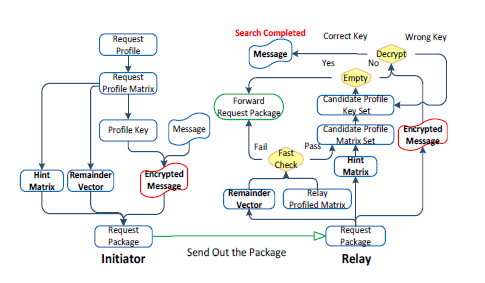

#### [Message in a Sealed Bottle: Privacy Preserving Friending in Social Networks](https://arxiv.org/pdf/1207.7199.pdf)

#### Related work

- treats a user's profile as a set of attributes, private set intersection (PSI) & private cardinality of set intersection (PCSI)
- considers a user's profile as a vector, private vector dot product
- no SMC-related private matching in mobile social networks
  - relies on PKC & HE, which results in expensive computation cost & trusted third party
  - unverifiable: only one party learns the matching result
  - vulnerable to active attacks
- it's difficult to establish PKC in **decentralized** networks

#### Our work

- first formally define the privacy preserving verifiable computation problem
- protocols without presetting & trusted third party
- much less computation, symmetric cryptosystem(Enc & Dec with same keys)
- **needs secure channel**

#### System Model

- Honest-but-curious(HBC) Model: every party is obliged to follow the protocol, but cannot intentionally "forget" knowledge that it learns during the execution of the protocol.[paper](https://ocw.mit.edu/courses/electrical-engineering-and-computer-science/6-876j-advanced-topics-in-cryptography-spring-2003/lecture-notes/lec050703.pdf)
- Malicious Model
  - Dictionary profiling
  - Cheating
- Man-in-the-Middle(MITM) attack, deny of service (DoS) attack
- Privacy protection level: PPL0~3, more secure

#### Construction

- main idea: use request profile as a key to encrypt a message
- 
  - Hint matrix: to support flexible fuzzy search, recovered the profile vector H_c'; note: attacker may try to recover profile vector, but it failed due to cannot solve the linear equation system
  - Remainder vector: H(A_k) mod p, for prime p large enough, efficient, without wasting the computation resource
  - Profile key: H(H(A_k)), candidate key H(H_c') which can decrypt the message correctly
- Lattice based location hashing
- profile matching protocols: protocol 1
  - initiator: Enc(confirmation, x) with key K_t
  - candidate: Dec with K_t to get x -> Enc(ack,y) with key x
  - then x+y is key for peer-to-peer secure communication or x is key for 1-to-n secure communication
  - this protocol can be attacked with dictionary attack (by recovering the profile vector), when the the dictionary size is not large enough
- protocol 2: malicious users
  - similar with protocol 1, but no confirmation info
  - the response time or cardinality of rely set is abnormal for a malicious users
- protocol 3: malicious initiator
  - profile Entropy, which is very large for a malicious initiator's profile

#### Security & Efficiency Analysis

- profile privacy
- communication security: thwarts the MITM attack
- verifiable: no cheating can be conducted successfully
- performance analysis

***

Establish secure channel

- RSA or Diffie-Hellman(DH) protocol
- DH protocol is known to be vulnerable to the MITM attack(think: how?)

