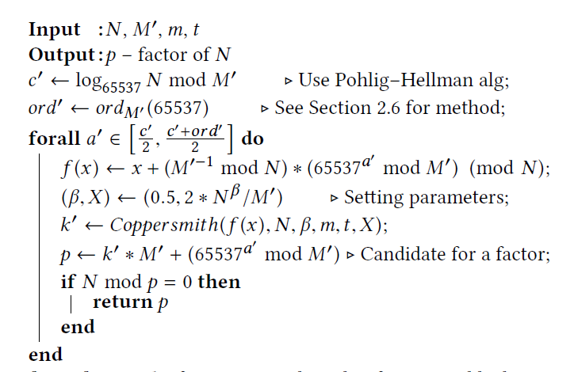

#### [The Return of Coppersmith’s Attack: Practical Factorization of Widely Used RSA Moduli](https://acmccs.github.io/papers/p1631-nemecA.pdf)

#### Background & Our work 

- construct a candidate number from several smaller components:
  - an improved resistance against certain factorization methods
  - certification requirements 
  - speedup of keypair generation

- primes generated by the library lacks entropy significantly
- the knowledge or recovery of all a private key is not always required due to the Coppersmith's method
- propose a **practical** factorization method which requires no additional info, devised an extension of Coppersmith's factorization attack

#### Factorization

- format: N=pq,  $p=k*M+(65537^a \mod M)$, here $M=2*3*5*7*...$
- fingerprinting: because M is smooth, it's easy to compute the discrete logarithm $\log_{65537}\mod M$, and identify whether the key is generated by `RSALib`
- Factorization: the reduction is possible due to the entropy loss is sufficiently high(by Coppersmith's method)
- 

- Coppersmith's algorithm in detail

  - problem -> f(x)=0 mod p -> g(x)=0 -> x_0
  - $g(x)=\sum_l a_l * f_l(x)$, which $f_l(x)$ and f(x) share the same roots modulo p as well
  - g(x) is found by the LLL algorithm using the fact that the root x_0 is small

  - LLL(Lenstra-Lenstra-Lovasz) algorithm reduces a lattice basis b_0,b_1,...,b_{n-1} to a sufficiently short vector as an alternative basis(therefore g(x) in the last step can be small)
  - Coppersmith's algorithm utilizes the LLL algorithm to find the desired polynomial g(x) with a small function value g(x_0)

- Coppersmith-Howgrave-Graham(CHG) method
  - construct f_i(x), i=0,...,n-1, then we have n bases
  - running time is mostly determined by the matrix size (n=m+t) in LLL reduction,m and t need to be optimized
  - X for the upper bound of k, $\beta$ for upper bound of p, hence $X\le 2*N^0.5/M'$, $\beta\le N^0.5$
- $p = k'*M' + 65537^{a'} \mod M'$, let $f'(x) = x*M'+(65537^{a'}\mod M')$, then $f(x)=x+(M'^{-1}\mod N)*(65537^{a'}\mod M')\pmod{N}$

#### Computation the order 

- ord' = ord_M'(65537) <=> 65537^ord' = 1mod P_i, for all prime factor P_i of M'
- ord' = lcm(ord_P1, ord_P2, ...) for P_i|M'g

#### Optimization

- Time = ord_M'(65537)*T(M',m,t)
- Optimized M': greedy heuristic -> local brute force search
- 
- Greedy heuristic: Initialized with M'=M, ord' = ord_M ->find the highest reward-at-cost value, with $p_i^{e_i}|ord'$, then new $ord' := ord'/p_i^{e_i}$-> use algo.2 to find M' -> repeat until $\log_2M'<\log_2N/4$
- Local brute force search, decreasingly & increasingly

#### Guessing strategy

- use c' obtained during the fingerprinting, c'=a+b (mod ord'), then either a or b occur in [c'/2, (c'+ord')/2]

#### Implementation & Analysis

- An estimation of factorization times and prices

- | Key size | University cluster        | Rented Amazon c4 instance      | Energy-only price ($0.2/kWh) |
    | -------- | ------------------------- | ------------------------------ | ---------------------------- |
    | 512 b    | 1.93 CPU hours (verified) | 0.63 hours, $0.063             | $0.002                       |
    | 1024 b   | 97.1 CPU days (verified)  | 31.71 days, $76                | $1.78                        |
    | 2048 b   | 140.8 CPU years           | 45.98 years, $40,305           | $944                         |
    | 3072 b   | 2.84 *10^25 years         | 9.28*1024 years, $8:13 * 10^27 | $1.90*10^26                  |
    | 4096 b   | 1.28*10^9 years           | 4.18*10^8 years, $3.66*10^11   | $8.58*10^9                   |

  