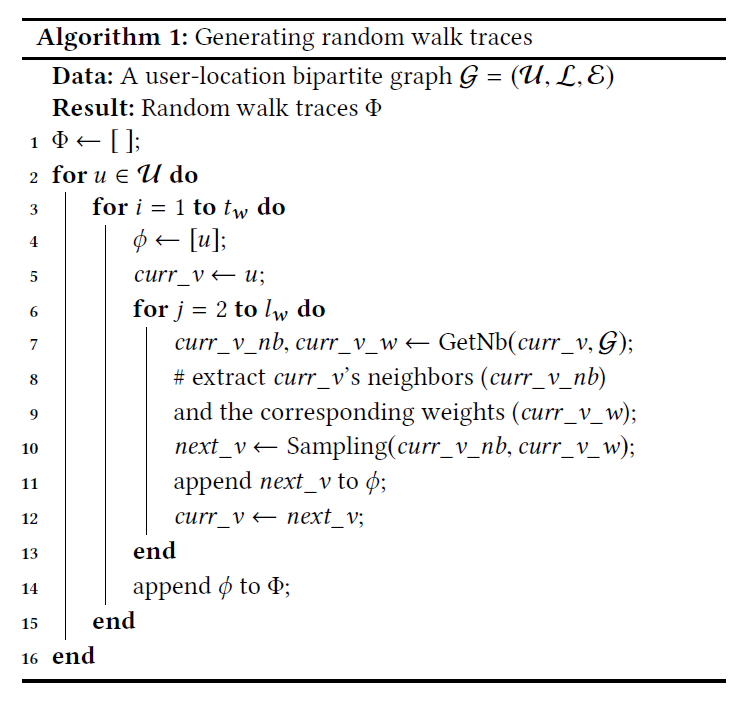

#### [walk2friends: Inferring Social Links from Mobility Profiles ](https://acmccs.github.io/papers/p1943-backesA.pdf)

#### our work

- a novel social relation inference attack
- not require the adversary to have prior knowledge
- effective, 13-20% improvement
  - inference attack, feature learning model, which preserves a user's mobility neighbors -> utilize similarity to infer if users are related
  - countermeasures, hiding & replacement & generalization

#### previous work

- conducted with a data-mining perspective, reduces the scope of their applicability
- no mitigation techniques have been proposed and evaluated so far for countering potential adversarial social link inference

#### Related work

- Backstrom et al., develop a maximal likelihood estimator to predict a user's undisclosed home location with his friends' data, outperforms traditional IP-based approaches significantly
- Eagle et al. have shown correlations between co-ocurrences & social connections
- Scellato et al. tried by proposing novel machine learning features including some existing social structure, while our work base on no-knowledge adversary
- Consider two users' meeting events instead of common locations

#### Model & Attack

- a user u visiting a location l at time t: <u,t,l>, set of all check-ins of u at l: $\tau(u,l)$
- G = (U,L,E), U: users, L: locations, E: edges with weight $w_{u,l}=|\tau(u,l)|$
- random walk traces
  - 
  - generate $U\cdot t_w$ random walk traces with $l_w$ steps long
- Skip Gram Model
  - shallow neural network, the parameter matrix presents the feature vector
  - objective function: $\arg max_\theta\prod_vp(N(v)|v;\theta)$, or $\arg max_\theta\prod_vp(\Delta=1|n,v;\theta)\prod_vp(\Delta=0|n,v;\theta)$
  - it's more efficient to compute the latter, stochastic gradient descend
- adversary model: infer social links or relations from mobility data
- adopt a random walk approach to obtain random walk traces -> feed to feature learning model ->measure similarity, predict whether exists a social link

#### Countermeasures

- Utility Metric
  - $P_u^o(A=l)$ is check-in distribution in the original dataset
  - $P_u^b(A=l) = \frac{\tau^b(u,l)}{\tau^b(u)}$ for $l\in\omega^b(u)$, here $l$ occurs in the set of unique locations the user has visited
  - utility loss is defined as JSD of two distribution $P_u^o$ and $P_u^b$
- Obfuscation Mechanisms
  - Hiding, remove a certain proportion
  - Replacement, replaces a certain proportion
  - Generalization