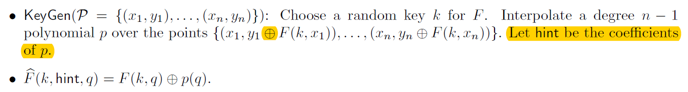

#### [Practical Multi-party Private Set Intersection from Symmetric-Key Techniques*](https://eprint.iacr.org/2017/799.pdf)

- why naïve hashing is not secure under semi-honest model?  suppose a participant has the same hashing item value with another one, then she knows the common element between them. This is a kind **additional** information except the intersection set.

- > the security of a secure multi-party protocol is formally define by comparing the distribution of the outputs of all parties in the execution of the protocol π to an ideal model

- the functionality of a protocol: it seems to be a map from given parameters to the behavior of the protocol 

- > we define a particular secure computation task by formally describing the behavior of the ideal functionality(trusted third party)

#### Preliminary

- OPRF: wait for input (q1,...,qt) from the receiver R -> sample a random PRF seed k and give it to the sender S -> give (F(k,q1),F(k,q2),...,F(k,qt)) to the receiver

#### Construction

- based on polynomials:
- Conditional zero-sharing: we consider the 2-party case, if $x\in X_1\cap X_2$, then $S_1(x) \oplus S_2(x)=0$, let $\mathcal{P}=\{(x_i,S_1(x_i))\}$, and $X_2$ be the inputs, denotes the outputs as $S_2$, so we know if $x\in X_1\cap X_2$, then $S_1(x)=S_2(x)$
- Conditional reconstruction: P1 acts as a centralized dealer

***

- this symbol means **xor**: 