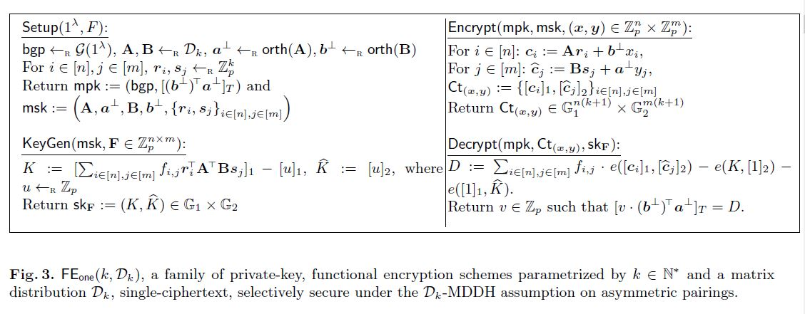
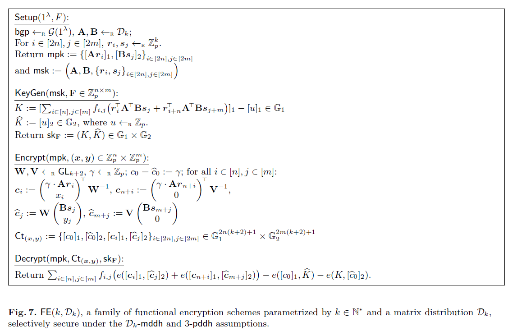

#### [Practical Functional Encryption for Quadratic Functions with Applications to Predicate Encryption](https://eprint.iacr.org/2017/151.pdf)

#### Contributions

- provide two functional encryption schemes for quadratic functions with linear-size ciphertexts
  - selective-secure under standard assumptions
  - bilinear maps represent a very general class of quadratic functions that includes
- our solutions work over asymmetric bilinear groups G1,G2,GT

#### Preliminaries

- a PPT A is a randomized algorithm for which there exists a polynomial p, s.t. for every input x, the running time of A(x) is bounded by p(|x|)
- bilinear group generator bgp=(p,G1,G2,GT,e,g1,g2) where G1 G2 GT have the same prime order p, $g1\in G1, g2\in G2$, e is a bilinear map
- Functionality & Functional Encryption
- Indistinguishability-based security

#### Overview

- 
- Correctness & Security
- 

#### Functional encryption scheme 

- Setup($1^\lambda$, n) -> KeyGen(msk, F) -> Encrypt(mpk,(x,y)) -> Decrypt($sk_F$, $C_t$)
- it's easy to prove the correctness
- Security
  - Theorem 5: the functional encryption scheme $FE_{GGM}$ satisfies against CPA in the generic bilinear group model
  - Master Theorem: bound the difference between the probabilities of the winning event E in the two executions 

#### Predicate Encryption for Bilinear Maps Evaluation

- how to build a predicate encryption scheme by functional encryption schemes

