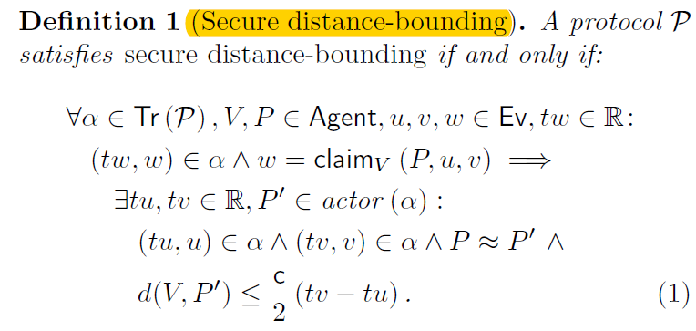
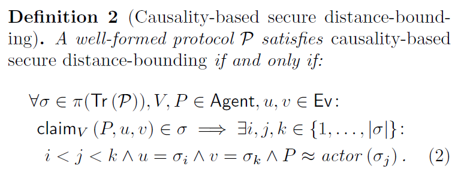

#### [Distance-Bounding Protocols: Verification without Time and Location*](https://www.computer.org/csdl/proceedings/sp/2018/4353/00/435301a549.pdf)

this paper is a **verification work** about a existing distance-bounding protocol

the first distance-bounding protocol:

- initial phase: parties agree on the parameters of the session
- fast phase: the verifier measures the round-trip times
- verification phase: verifier make a decision on whether the prover successfully passed the protocol'

Hancke & Kuhn's ...

main difference between Brands' and Hanckle's protocol:

- the fast phase messages don't rely on long term secret keys in the former

#### Attacks

- mafia-fraud attacks
- distance-fraud attacks
- terrorist-fraud attacks
- distance hijacking
- farther adversary attacks: to include the prover's identity in the signature

#### Security Model

> a verifier V cannot securely decide whether a particular dishonest prover is close, but it can claim like "some knows P's secrets is close"

- Secure distance-bounding

i.e. A distance-bounding protocol is secure if the occurrence of a claim event $claim_v(P,u,v)$ is a protocol execution implies that V has correctly computed an upper bound on his distance to either P(honest) or some dishonest agent P'

#### Verification

main theorem:

>  causality-based secure distance-bounding is equivalent to the original definition of secure distance-bounding

