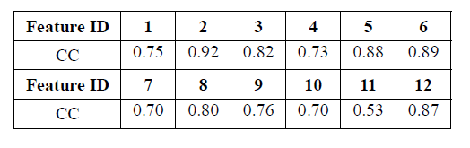

#### [Multi-touch Authentication Using Hand Geometry and Behavioral Information](https://www.ieee-security.org/TC/SP2017/papers/228.pdf)

- our work combine both geometry information & behavioral characteristics, then overcome the problem of behavioral variability
- security analyses are conducted to this method is resilient against common threats
- all existing behavioral biometrics-based authentication methods suffer a crucial problem: users' behavioral is uncontrollable

#### threats model

- we do not assume the adversary has the power to produce an apparatus, our method is designed to secure against:
  - zero-effort attack
  - smudge attack: utilizes the traces left on the screen
- TFST gestures: a set of multi-touch gestures performed with fingers straight and together, i.e. multi-touch traces, physiological features, behavior features

#### Analysis

- hand geometry of different people show discernibility
- correlation coefficients between  features of handle geometry and TFST
- one-class classifiers: we have only the training data from legitimate users

#### Security

- Zero-effort attack

- >  zero-effort attack may be the most common type of attack against an authentication system where the attacker guesses the secret or tries the authentication procedure

- smudge & shoulder surfing attack

- statistical attack: the basic idea is to estimate the prob. density functions of features from a group of people, then use the most probable feature values to generate the forgery