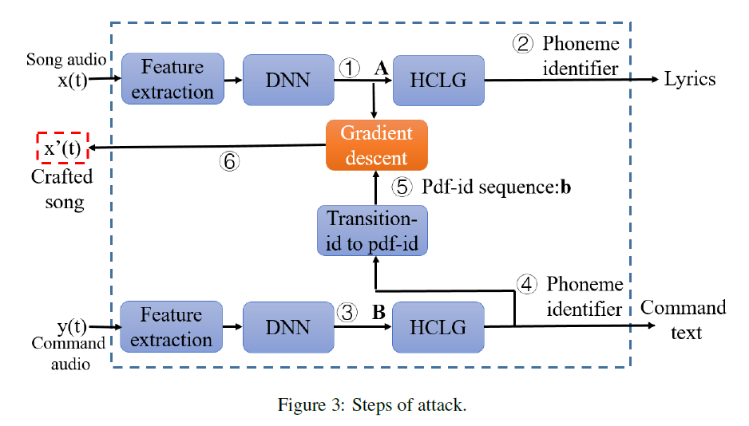

#### [CommanderSong: A Systematic Approach for Practical Adversarial Voice Recognition](https://arxiv.org/pdf/1801.08535.pdf)

- void commands can be stealthily embedded into songs
- integrating the commands into a song can be done automatically against real world ASR

- architecture of ASR: void -> feature extraction -> acoustic models -> language models -> text

#### Overview 

- design the revision algorithm to maximally preserve the fidelity of the original song
- an ASR system is usually composed of two pre-trained models: acoustic models & language models; 
- conclude the "information" in the output that is necessary for the language model to produce the correct text of the desired command

#### Attack approach

- challenges: minimizing the perturbation to the song; making the attack practical
- incur minimum revision at the output of the acoustic model, and use gradient descent to generate the corresponding adversarial samples; introduce a generic noise model to simulate
- 
- analyzing the decoding procedures: **pdf-id sequence matching algorithm**
- don't consider the invariance of background noise in different environments, e.g. grocery, restaurant, office, due to 
  - in a quite noisy environment, even original voice command may not be correctly recognized by IVC devices
  - modeling any slightly variant background noise is difficult
  - in a normal environment the major impacts is a electronic noise rather than background noise