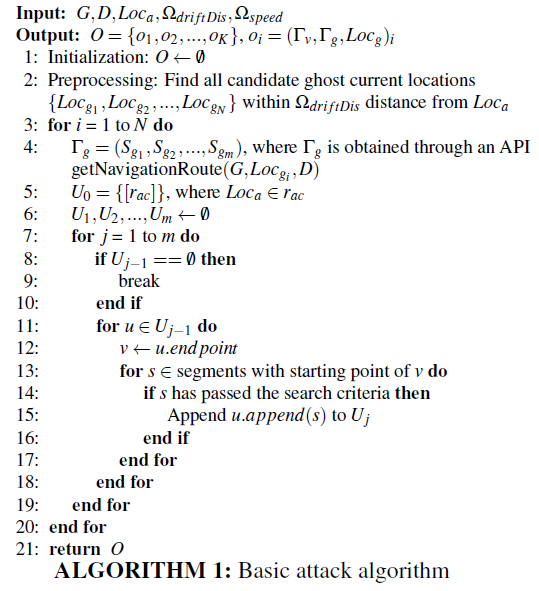

#### [All Your GPS Are Belong To Us: Towards Stealthy Manipulation of Road Navigation Systems](https://www.microsoft.com/en-us/research/uploads/prod/2018/06/security18gps.pdf)

- a stealthy manipulation attack against road navigation systems
- the victims are more likely to rely on GPS services when navigating in unfamiliar areas: it's possible to trigger navigation instructions that are consistent with the physical environment

#### Threat Model

- three purposes realized by attacker:
  - deviating attack
  - target deviating attack
  - endangering attack

#### Preliminary

- measurement steps: the attacker can place the small spoofer in victim's car; the attacker may tailgate the victim's car 

- > to make the driver believe he is driving on the original route, the key is to find a virtual route that mimics the shapes of the real roads

- attack formulation: road model, navigation route, attack objects and constraints

#### Design

- **road network construction** and **attack route search**
- design a algorithm for searching ghost locations and victim routes
- iterative attack allows the attacker to create multiple drifts at different locations