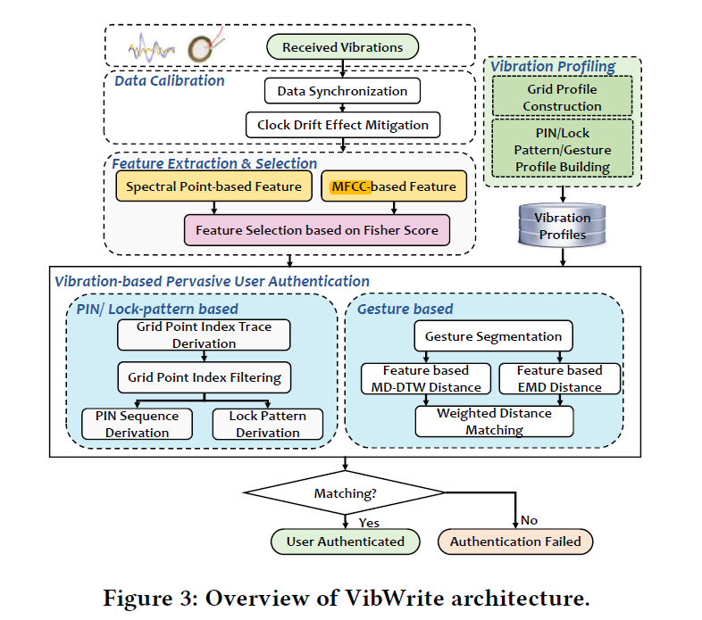

#### [VibWrite: Towards Finger-input Authentication on Ubiquitous Surfaces via Physical Vibration](https://acmccs.github.io/papers/p73-liuAemb.pdf)

#### Our work

- VibWrite is a low-cost, tangible, enhanced security solution, also has high accuracy

- VibWrite captures intrinsic human physical characteristics

#### Attack model

  - blind attack
  - credential-aware attack
  - knowledgeable observer attack
  - **side channel attack**

#### System Overview

- Data calibration: data synchronization & clock drift effect mitigation
- extracts and select vibration features(in section 5)
  - profiling
  - authentication

Three types of authentication(in section 6-7):

- PIN
- Lock patterns
- Gestures

#### Signal design, feature extraction & selection

- we could guarantee that each sliding window being used to extract vibration features contains the same parts ---add a pseudo-noise sequence preamble
- spectral point-based feature extraction and MFCC-based feature extraction
- selecting features based on Fisher score

#### Authentication using PINs & lock patterns

- derive vibration features in every sliding window, then apply SVM to estimate the finger-press positions
- filter the grid point indices
- difference between pressing PINs and swiping lock patterns
- **security**: all the vibration features of the attacker are incorrectly classified

#### Authentication using gestures

- VibWrite extracts vibration features from spectral points and MFCC then calculates vibration feature differences between the received vibration signals and , which is largely different between the finger swipes and release on the surface
- same user have a similar distribution of features
- the user swipes a finger following a **predefined** gestures when construct the gesture profile

#### About side-channel attacks

- attacks via a vibration receivers: the signals received by hidden receives present very different patterns comparing to original(CHAOS of signals??)
- attacks via a nearby microphone: the additional transmission path can largely change the vibration patterns, make it difficult to recover