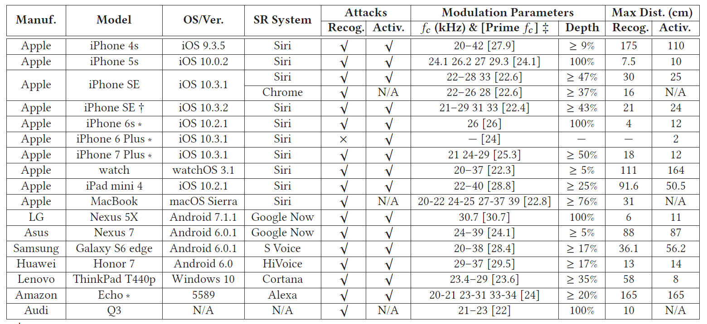

#### [DolphinAttack: Inaudible Voice Commands](https://acmccs.github.io/papers/p103-zhangAemb.pdf)

> many security studies on voice controllable systems focus on attacking either the speech recognition algorithms or command execution environment. This paper aims at the void capturing subsystem, which will be detailed in the next subsection.

#### Nonlinearity effect modeling

- amplifier are known to have nonlinearity, $s_{out}(t)=A*s_{in}(t)+B*s_{in}^2(t)$, let $s_{in}(t)=m(t)cos(2\pi f_c t)+cos(2\pi f_c t)$, after a LPF(低通滤波器), all high-frequency components will be removed and $f_m$ frequency component will still remain

#### Voice command generation

- activation commands
  - an attacker cannot find the owner : TTS-based brute force
  - an attacker can obtain a few recordings of the owner's voice: concatenative synthesis
- control commands: an SR system doesn't authenticate the identities of control commands

#### Voice command modulation

- modulation depth is directly related to the utilization of the nonlinearity effect of microphones
- $f_c-w>20kHz$, to find the best carrier frequency, we measure the frequency response of the speaker and microphones
- voice selection: a female void typically has wider frequency band than what a male void has, which results in a larger prob. of frequency leakage over audible frequeny range

#### Voice commands transmitter

- powerful transmitter with a signal generator
- portable transmitter with a smartphone

#### Experiment results

#### Defense

- root cause: the microphones an sense acoustic sounds with frequency higher than 20 kHz
- inaudible void command cancellation
- software-based defense: the signal in the frequency range from 500 to 1000 Hz is significantly different 