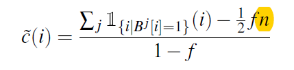

#### [Locally Differentially Private Protocols for Frequency Estimation](https://www.usenix.org/system/files/conference/usenixsecurity17/sec17-wang-tianhao.pdf)

##### Difference between DP and LDP

DP:

> An algorithm A satisfies ε-dp, where ε>=0, if and only if for any datasets D and D' that differ in one element, we have $\forall t\in Range(A):Pr[A(D)=t]\le e^\epsilon Pr[A(D')=t]$, where Range(A) denotes the set of all possible outputs of A

LDP:

> An algorithm A satisfies ε-LDP, where ε>=0, if and only if for any input v1 and v2, we have $\forall y\in Range(A): Pr[A(v1)=y]\le e^\epsilon Pr[A(v2)=y]$ where Range(A) denotes the set of all possible outputs of A

##### A Claim:

Proof. we divide this equation by n in both sides, then we need to prove $(1-f)E[B_0[i]]=E[B_1[i]]-\frac{1}{2}f$, we know $E[B_1[i]]=(1-\frac{1}{2}f)E[B_0[i]]+\frac{1}{2}(1-E[B_0[i]])$, hence $\tilde{c}(i)=E[B_0[i]]$, we have prove it.

> As the estimation $\tilde{c}(i)$ is the sum of many independent random variables, its distribution is very close to a normal distribution, thus the mean and the variance of $\tilde{c}(i)$ fully characterizes the distribution $\tilde{c}(i)$ for all practical purposes.

There is a mathematical details which are not rigorous enough in this paper.

> $Pr[Lap(\beta)=x]=\frac{1}{\beta}e^{-|x|/\beta}$

it should be

> $Pr[x\le Lap(\beta)\le x+dx]=\frac{1}{\beta}e^{-|x|/\beta}dx$

实数域上限定均值和方差，熵最大的分布是正态分布

正实数域上限定均值，熵最大的分布是指数分布（拉普拉斯分布）

[a,b]上限定均值，熵最大的分布是平均分布