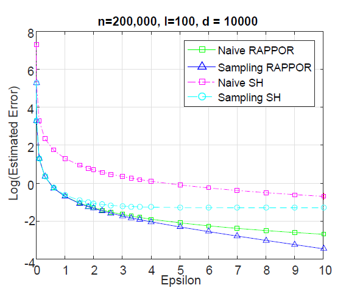

#### [Heavy Hitter Estimation over Set-Valued Data with Local Differential Privacy](https://davidyinyang.weebly.com/uploads/9/8/6/2/9862052/ccs16-ldp.pdf)

 Existing work:

> each user reports to the data collector much information that is not relevant to the final result

Here Succinct histogram(SH) means the Random Matrix Projection in paper [Locally Differentially Private Protocols for Frequency Estimation](https://www.usenix.org/system/files/conference/usenixsecurity17/sec17-wang-tianhao.pdf)

> instead of reporting d bits as is done in RAPPOR, in SH each user only reports one random chosen bit

> Furthermore, when l is relatively large, RAPPOR incurs rather high sensitivity, and, thus, heavy perturbation of the released bit vectors, leading to low accuracy.

#### main idea, both two phases use SH

> LDPMiner splits the privacy budget ε at each user into two part ε1+ε2=ε, and allocate them to phase1 and phase2

