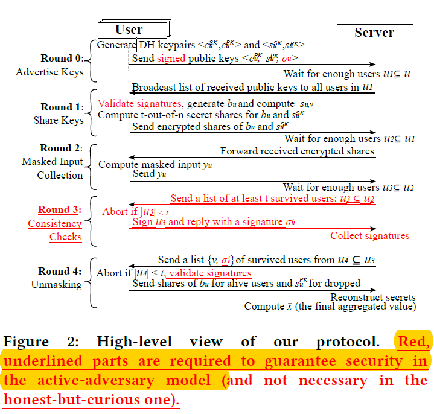

#### [Practical Secure Aggregation for Privacy-Preserving Machine Learning](https://acmccs.github.io/papers/p1175-bonawitzA.pdf)

#### Our work

- present a protocol for securely computing sums of vectors
- more efficient and can be proven secure against honest but curious adversaries

#### Cryptographic primitives

- the scheme consists of two algorithms:
  - SS.share(s,t,U)->{(u,s_u)}
  - SS.recon({(u,s_t)},t)->s
- Correctness: recon*share = id
- Security: all the outputs of share function are identical
- Key agreement

#### Technical intuition

- 
- shortcomings: high communication overhead & no tolerance for a party failing
- handing: pseudorandom generator(PRG) with common seed 
- double-masking to protect security: each user samples an additional random seed b_u, then shares them; the server recovery the correct sums

#### High level view

#### Security analysis

- Lemma 6.1, says if users' values has uniformly random pairwise masks added to them, then the resulting values look uniformly random
- Theorem 6.2(honest but curious security, against clients only): the joint view of any subset of honest users can be simulated give only the knowledge the inputs of those users
- Theorem 6.3(honest but curious security, with curious server)

#### Summary

this secure aggregation protocol is motivated by federated learning, which has a need for calculating sums of **high-dimension** vectors, so what will happened under low-dimension situation?