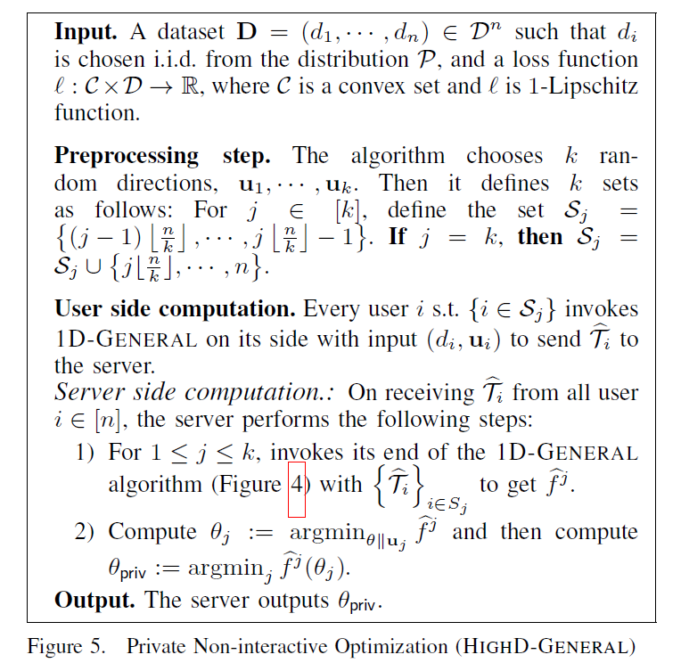
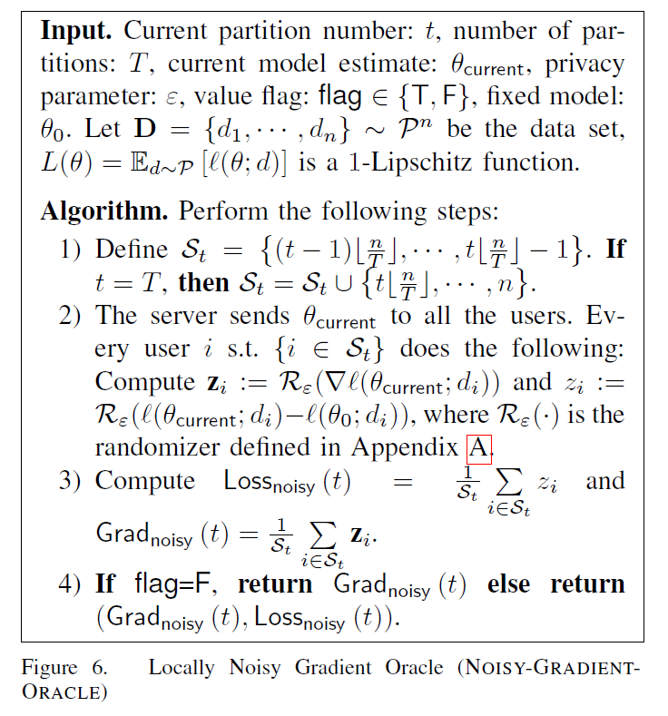

#### [Is Interaction Necessary for Distributed Private Learning?](https://www.ieee-security.org/TC/SP2017/papers/373.pdf)

#### Our work

- focus on convex optimization, provide new algorithm for noninteractive LDP optimization
- exponential dependence is necessary

#### Background

- (typical setting) Duchi et al. gave an n-round algorithm with expected population risk, their algorithm is a LDP version of stochastic gradient descent:

- > at round i, the server sends the current estimate θi to player i, who returns a noisy gradient $Q(\nabla l(\theta_i;d_i))$

#### Contribution

- Theorem 2: for the typical setting above, there is an ε-LDP algorithm A s.t. for all distributions P on D, with high probability, $err_P(A(D))=\tilde{O}((\frac{\sqrt{p}}{\epsilon^2 n})^{1/(p+1)})$, where $\tilde{O}(\cdot)$ hides log(n) factors.

- Theorem 3: there exists C>0 s.t. for all sufficiently small α>0 and every neighborhood-based oracle O(.), every C log (1/α)-round randomized requires $2^{\Omega(p)}$ queries to succeed with high probability

- Private Non-interactive optimization (high d-general) 

- >  for a natural class of algorithms, the exponential dependence on the dimension is essential

- (Theorem 12): says to get constant success probability, any non-adaptive algorithm has to make number of queries exponential in the dimension of the underlying convex set

- (Theorem 13): a extension for the theorem 12

- (Theorem 16): following protocol is ε-LDP 

#### Conclusion

- for very low-dimensional convex optimization, reasonable noninteractive protocols
- a few rounds of interaction help enormously

> the choice of the best algorithm is likely to depend on the the data at hand and the tradeoff between various aspects of the problem structure(dimension, smoothness, strong convexity)