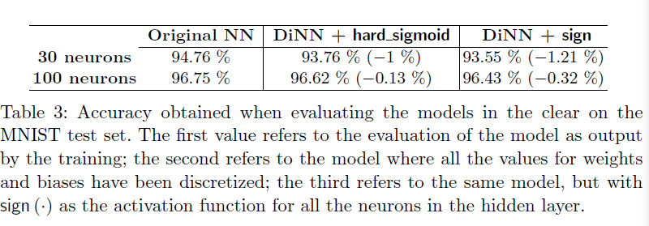

#### [Fast Homomorphic Evaluation of Deep Discretized Neural Networks](https://eprint.iacr.org/2017/1114.pdf)

#### Our work

- adopt a scale-invariant approach to the problem(FHE-DiNN), which the complexity is **strictly linear** in the depth of the network, and the parameters can be set beforehand
- conducted experiments on the MINIST dataset

#### DiNN

- a **discretized neural network** is a feed-forward artificial neural network whose inputs are integer values in {-I,...,I} and whose weight are integer values in {-W,...,W}, for some $I,W\in\mathbb{N}$, activation function maps the inner product between the incoming inputs vector and the corresponding weights to integer values in {-I,...,I}
- how to transfer a traditional neural network to a DiNN

#### FHE-DiNN

- Extended LWE-based PKE scheme
- homomorphic computation of the sign function
- Correctness: we say the HE of the neural network is correct if the decryptions of its output scores are equal to the scores given by its evaluation in the clear 

#### Refinement

- reducing bandwidth usage: pack multiple values into one ciphertext
- reducing the dimension in the beginning of the bootstrapping procedure instead of the end gave much better results
- reduce the probability of errors 

#### Experiments
- accuracies obtained on the MINIST test set:
  

  
