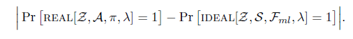
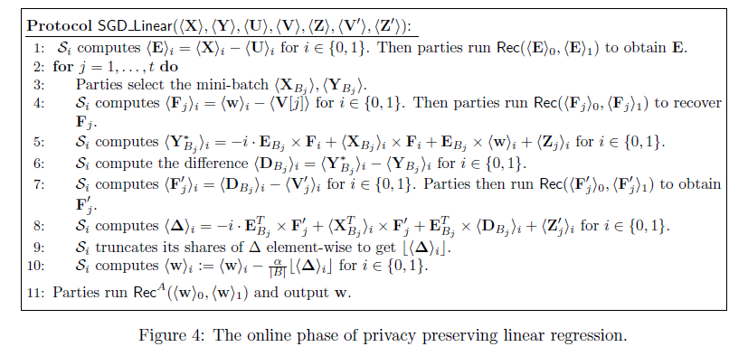
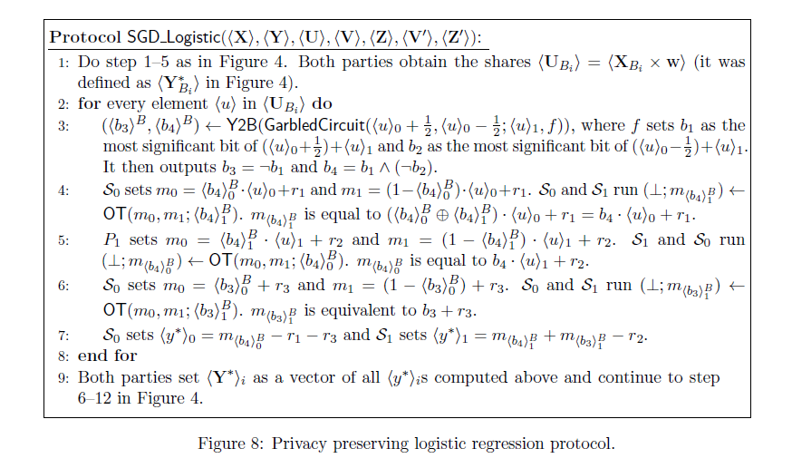

#### [SecureML: A System for Scalable Privacy-Preserving Machine Learning](https://eprint.iacr.org/2017/396.pdf)

#### Our work

- new protocols for privacy preserving ML: linear regression, logistic regression, neural network training(MPC under two-server model)
- more efficient than the state of art solutions for the same problem

#### Security Model

- architecture: a set of clients, two server: evaluator and the cryptography service provider(CSP)
- a semi-honest adversary can corrupt any subset of the clients and at most one of the two servers
- a protocol π securely realizes a functionality $\mathcal{F}_{ml}$ if for every admissible adversary A attack the real interaction, there exists and adversary S attacking the ideal interaction, s.t. 

#### Privacy preserving ML

- vectorization in the shared setting

- privacy preserving linear regression
- how to implement the offline phase as a two-party protocol between two servers
  - LHE-based generation
  - OT-based generation
- privacy preserving logistic regression
- privacy preserving  NN training

#### Client-Aided Offline Protocol

- client-aided multiplication triplets generation significantly improves the efficiency
- communication & storage are also increased
- client-aided protocols are secure under the new security model