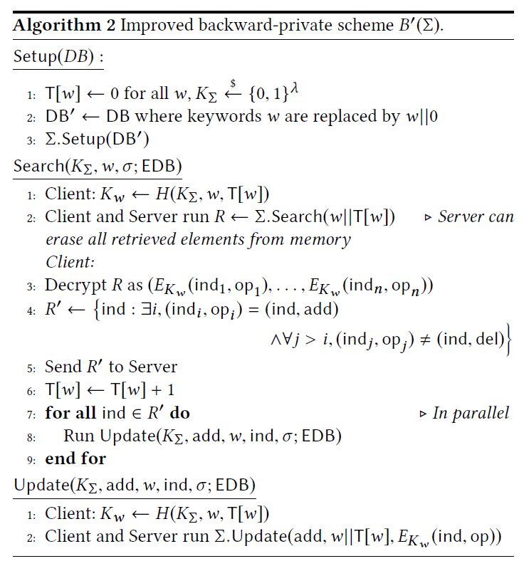

#### [Forward and Backward Private Searchable Encryption from Constrained Cryptographic Primitives](https://acmccs.github.io/papers/p1465-bostA.pdf)

#### Our work

- first time the notion of backward privacy for searchable encryption
- give formal definitions for different flavors of backward privacy
- several schemes achieving both forward & backward privacy

#### Previous work

- Dynamic SSE: the server is able to infer as little as possible about the content of the database
- leakage-abuse attacks show how seemingly benign leakage functions can be exploited, forward privacy mitigates these attacks: newly updated entries cannot be related to previous search results

#### Related work

- searchable encryption, [read more](11.md)
- constrained cryptographic primitives, mostly rely on indistinguishability obfuscation -- we only require cryptographic & pseudo-random functions
- secure deletion, using cryptography to erase info.

#### Background

- $\lambda$: security parameter, negl($\lambda$): negligible function

- constrained pseudorandom functions(PRFs) is a mapping $F:\{0,1\}^\lambda\times X\to Y$ and a pair of algorithms (F.Constrain, F.Eval)

  - F.Constrain(K,C) is a PPT algorithms, outputs a constrained key $K_c$
  - F.Eval($K_c,x$) is a DP algorithm, $x\in X$, outputs $y\in Y$

- Correctness: iff C(x)=1 implies F(K,x)=F.Eval($K_C,x$), here $K_C$=F.Constrain(K,C)

- Security: describe by a security game

  - challenger randomly picks a key $K\overset{\$}{\leftarrow}\{0,1\}^\lambda$, $b\overset{\$}{\leftarrow}\{0,1\}$
  - Eval(x) -> F(K,x), Constrain(C)->F.Constrain(K,C), Challenge(x) if b = 0 outputs F(K,x) otherwise a uniform element in Y
  - The adversary guess b

- Bilinear Maps

- Dynamic Symmetric Searchable Encryption is a triple (Setup, Search, Update) consists of a algorithm and two protocols

  - Setup(DB): it takes a database DB, outputs a triple (EDB, $K_\Sigma,\sigma$), here EDB is the encrypted database, $\Sigma$ the master secret key, $\sigma$ the client's state
  - Search($K_\Sigma, q,\sigma$, EDB)=(Search_C($K_\Sigma,q,\sigma$),Search_S(EDB)) is a protocol
  - Update($K_\Sigma,\sigma$,op,in;EDB)

  An SSE is correct if the search protocol returns the correct result for every query, except with negligible prob.

- leakage function(**不懂，这文章有毒，leakage function这么重要的概念都不讲清楚？**)

- Forward privacy: an L-adaptively-secure SSE scheme is forward-private iff the update leakage function $L^{Updt}$ cant be written as: $L^{Updt}(op,in)=L'(op,\{(ind_i,\mu_i)\})$

- Backward privacy: 

  - Backward privacy with insertion pattern
  - Backward privacy with update pattern
  - Weak backward privacy

#### A Generic Two-Roundtrip Backward-Private Scheme

- 
  - scheme $B'(\Sigma)$ is backward-private since the server learns document indices after removed
  - document indices are re-encrypted after each search
- Fides

#### Diana

- Forward-Secure SSE from Range Constrained PRFs(FS-RCPRF): adversary cannot predict the evaluation, due to she only gets to see the CPRF keys
- Adaptive security of FS-RCPRF
- instantiation:
  - Let $G:\{0,1\}^\lambda\to\{0,1\}^{2\lambda}$ a pseudo-random generator, define $F_K(x)=G_{x_n-1}(...(G_{x_1}(G_{x_0}(K))))$, the output values of F construct a tree, which can be labeled according to the corresponding input
  - generate the nodes leaves with labels in [0,c-1]

- Diana_del: $\tilde{F}$ is not only range-constrained but also punctured on deleted entries; server store the deleted entries in an encrypted form

#### Janus

- puncturable encryption(PPKE)
  - KeyGen($1^\lambda$) outputs a public key PK
  - Encrypt(PK,M,t) outputs the encryption CT of $M\in\mathcal{M}$ attached to the tag $t\in\mathcal{T}$
  - puncture($SK_i,t$) outputs a new secret key $SK_{i+1}$
  - decrypt($SK_i,CT,t$) outputs a plaintext $\mathcal{M}$ or false if decryption fails
- Security game:  
  - setup phase, challenger initializes two empty sets P,C,T, a counter n, let (PK,SK_0)<-PPKE.KeyGen($1^\lambda$), picks b from {0,1}
  - query phase: puncture(t)->corrupt()->challenge(M_0,M_1,t), return CT<-PPKE.Encrypt(PK,M_b,t)
  - guess phase: guess b
- Incremental puncture
- Construction:
  - $\Sigma_{add},\Sigma_{del}$
  - insert: client encrypt (w,ind) wih the key $sk_0[w]$
  - delete: client computes the tag t = F(w,ind), and puncture on it
  - search: client runs a search on w for both$\Sigma_{add},\Sigma_{del}$
- Security: Janus is a forward-private and weakly backward-private SSE scheme
- Reducing Storage Overhead
- Security against weaker adversaries: even if a deleted entry matched a search query processed before the corruption, it should be infeasible for the adversary to recover

***

- [Public Key Encryption with Keyword Search](11.md)
