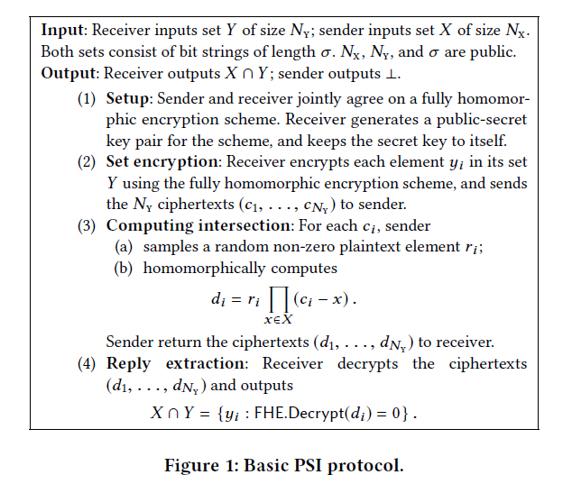
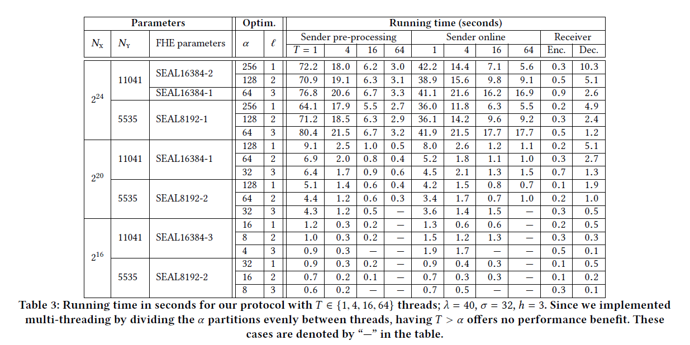
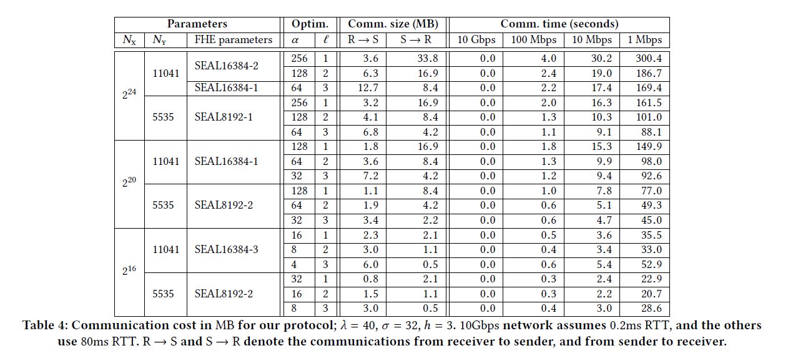

#### [Fast Private Set Intersection from Homomorphic Encryption](https://acmccs.github.io/papers/p1243-chenA.pdf)

#### Background & Disadvantages

- Private Set Intersection(PSI) allows two parties to compute the intersection without revealing others, we usually use fully homomorphic encryption to construct PSI protocol
- Fully homomorphic encryption: evaluate directly on encrypted data, as oppose to having to decrypt data, it not only grows with the size of inputs, but also with the depth of circuit
- hash functions & oblivious transfer: computationally efficient but communication complexity

#### Related work

- Meadows: the first secure PSI protocol
- Huberman et al.: fully described base on PKC, leveraged the property of DH key exchange
- Freedman et al.: based on oblivious polynomial evaluation
- more promising approaches base on Oblivious Transfer(OT) have been invented
- all of the above protocols assumed the set sizes are made public at the beginning

#### Our work

- our protocol has communication complexity linear in small size, logarithmic in large size(38-115 x reduction), particularly powerful when the sender's set is much larger than receiver's set
- combine various optimizations to vastly reduce the computational & communication cost
- use fine-tuned fully HE parameters to avoid the costly *boot-strapping* operation & achieve good performance

#### Preliminaries

- the sender holds a set X of size N_X, receiver holds a set Y of size N_Y, PSI computes the intersection, outputs nothing to sender, $X\cup Y$ to receiver; achieve a communication complexity of $O(N_Y\log N_X)$

- private contact discovery

- leveled fully homomorphic encryption: can be described by the following set of randomize algorithms:

  - FHE.Setup($1^\lambda$), outputs a set of encryption param
  - FHE.KeyGen(params)outputs secret key(sk) & public key(pk), evaluation key(evk)
  - FHE.Encrypt(m,pk), outputs message m
  - FHE.Decrypt(c,sk), outputs decryption of c
  - FHE.Evaluate(C,(c_1,...,c_k),evk)

  $\mathrm{Pr}[FHE.Decrypt(c,sk)\neq f(m_1,...,m_k)]=negl(\lambda)$

  we say FHE is secure if it's IND-CPA secure, and weakly circular secure

#### Basic Protocol

- the receiver encrypts each of its items y, sends them to the sender
- for each y, sender evaluates homomorphically the product of differences of y with all of the sender's items x, randomizes the product by multiplying it with a uniformly random no-zero plaintext, sends it back to the receiver
- the result decrypt to zero precisely when y is in the sender's set
- 
- Theorem 3.1, the protocol in figure1 securely & correctly computes the private set intersection of X and Y in the semi-honest security model
- inefficiency: sender performs $O(N_XN_Y)$, sender and receiver need to communicate $O(N_Y)$ FHE ciphertexts

#### Optimizations

- batching: there is a ring isomorphism : $R_t\to\mathbb{R}^n_t$, which translate polynomial additions and multiplications into coefficient-wise additions and multiplications; reduce both the computational and communication cost
- hashing: 

  - cuckoo hashing
  - permutation-based hashing
  - hashing failure
- reducing the circuit depth

  - windowing: use a standard windowing technique to lower the depth of the circuit
  - partitioning: perform one PSI protocol execution per each subset
- reducing reply size via modulus switching: transforms a ciphertext with encryption parameter q into a ciphertext encrypting the same plaintext, but with q'<q

#### Discussion

- function privacy, malicious behavior, when receiver holds larger set

#### Performance

- Computation overhead: 
- Communication overhead: 