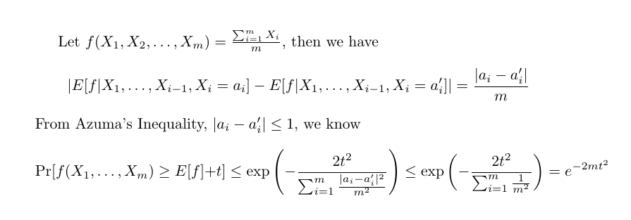

#### Basic Techniques and Composition Theorems

##### Useful probabilistic tools

- **Additive Chernoff Bound & Multiplicative Chernoff Bound**: mean can be estimated with expectation with small deviation

- Azuma's Inequality: we can prove Chernoff bound from Azuma's Inequality

- Stirling's Approximation

##### Randomized response

privacy is obtained by process, there are no good or bad response

##### The Laplace mechanism

- $l_1$-sensitivity, Laplace distribution
- Theorem 3.6: Laplace mechanism preserves $(\varepsilon,0)$-differential privacy
  - Counting queries: e.g. how many elements in the database satisfy Property P? we can achieve $(\epsilon,0)$-differential privacy for it by addition of noise scaled to $1/\epsilon$ (From theorem 3.6)
  - Example 3.3 (First Names)
>
Suppose we wish to calculate which first names, from a list of 10000 potential names, were the most common among participants of the 2010 census. This question can be represented as a query $f:\mathbb{N}^{|X|}\to\mathbb{R}^{10000}$. This is a histogram query, and so has sensitivity $\Delta f=1$, since every person can only have at most one first name. Using the above theorem, we see that we can simultaneously calculate the frequency of all 10000 names with (1,0)-differential privacy, and with probability 95%, no estimate will be off by more that an additive error of $\ln{(10000/0.05)}\approx 12.2$. (take $\delta =0.05,\epsilon = 1, k = 1000$)

- Differential Private Selection
##### Report Noisy Max(RNM)

- add independently generated Laplace noise Lap($1/\epsilon$) to each count and return the index of the largest noisy count
- the vector of counts has high $\mathcal{l}_1$-sensitivity, much more noise would be needed if we wanted to release all of the counts
- (Claim 3.9) RNM is $(\epsilon,0)$-differentially private

##### Exponential Mechanism

- natural building block for answering queries with **arbitrary** utilities (and arbitrary non-numeric range)
- utility function $u:\mathbb{N}^{|X|}\times\mathcal{R}\to\mathbb{R}$ maps database & output pair to utility scores, $\Delta u = \max_{r\in\mathcal{R}}\max_{x,y:||x-y||_1\le 1}|u(x,r)-u(y,r)|$

- select and outputs an element $r\in\mathcal{R}$ with prob. proportional to $\exp{\frac{\epsilon u(x,r)}{2\Delta u}}$, it can define a complex distribution over a large arbitrary domain, the privacy loss is approximately $\ln(\frac{\exp{(\epsilon u(x,r)/\Delta u})}{\exp{(\epsilon u(y,r)/\Delta u})})=\epsilon(u(x,r)-u(y,r))/\Delta u\le\epsilon$
- Theorem 3.10 The exponential mechanism preserves $(\epsilon,0)$-differential privacy

##### Composition theorems 

- Theorem 3.14: let $M_1$ be an $\epsilon_1$-differentially private algorithm, $M_2$ be an $\epsilon_2$-differentially private algorithm, $M_{12}=(M_1(x),M_2(x))$ is $\epsilon_1+\epsilon_2$-differentially private
- A mechanism M is $\epsilon$-differentially private if and only if on every two neighboring database x and y, $D_\infty(M(x)||M(y))\le\epsilon$  and $D_\infty(M(y)||M(x))\le\epsilon$, and is $(\epsilon,\delta)$-differentially private if and only if on every two neighboring database x,y: $D_\infty^\delta(M(x)||M(y))\le\epsilon$ and $D_\infty^\delta(M(y)||M(x))\le\epsilon$

- Lemma 3.18: suppose $D_\infty(Y||Z)\le\epsilon$ and $D_\infty(Z||Y)\le\epsilon$, then $D(Y||Z)\le\epsilon(e^\epsilon-1)$

##### Advanced composition theorems

- $\mathcal{F}$ could be the set of all ε-differentially private mechanism
- For all ε,δ,δ'>=0, the class of (ε,δ)-differentially private mechanism satisfies (ε',kδ+δ')-differential privacy under k-fold adaptive composition for: $\epsilon'=\sqrt{2k\ln(1/\delta')}+k\epsilon(e^\epsilon-1)$
- 

> So how many queries can we answer with non-trivial accuracy? On a database of size n let us say the accuracy is non-trivial if the error is of order o(n). Theorem 3.20 says that for fixed values of ε and δ, it's possible to answer close to $n^2$ counting queries with non-trivial accuracy.

##### Laplace versus Gauss

- Theorem 3.22, Let $\epsilon\in(0,1)$ be arbitrary, for $c^2>2\ln(1.25/\delta)$, the Gaussian Mechanism with parameter $\sigma\ge c\Delta_2(f)/\epsilon$ is (ε,δ)-differentially private

##### The sparse vector technique

- Reference: M. Lyu et al., Understanding the Sparse Vector Technique for Differential Privacy

